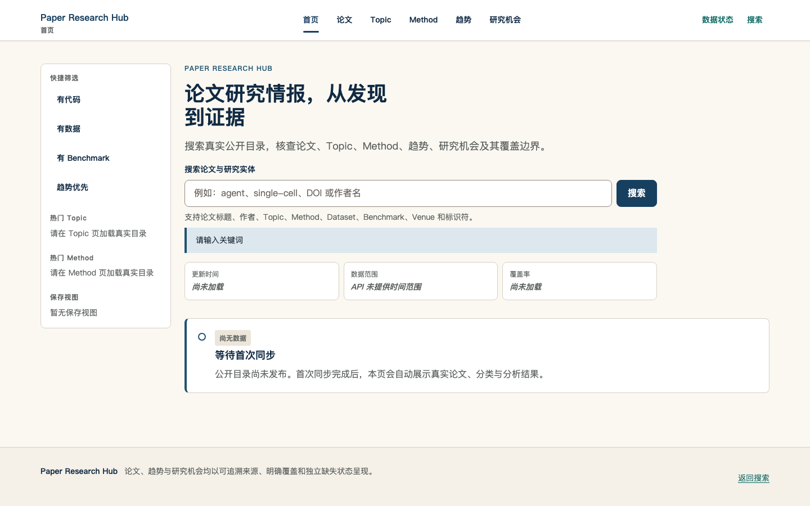
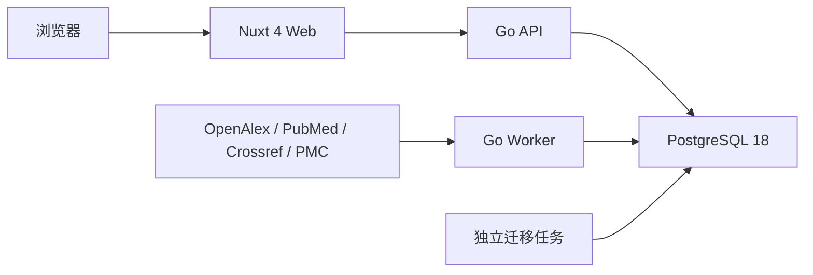

# Paper Research Hub

Paper Research Hub 是一个面向论文发现、证据追踪与研究机会分析的公开门户。后端采用 Go 模块化单体，前端采用 Nuxt 4，PostgreSQL 是唯一规范数据存储。仓库不注入演示论文或 mock 数据；首次启动完成迁移后，界面会如实显示空数据状态，Catalog API 在首次显式发布 generation 前返回 `503 catalog_not_published`。



## 架构



同一个 Core 镜像包含三个独立二进制：

- `/app/paper-hub-api`
- `/app/paper-hub-worker`
- `/app/paper-hub-migrate`

迁移是一次性任务。Worker 是通过 `docker compose run` 或调度系统显式触发的同步、导入或 Catalog 发布任务，不作为无参数常驻进程启动。API 和 Worker 都不会在启动时隐式执行迁移，也不会隐式发布 Catalog。

## 一键本地启动

前置条件：

- Docker Engine 或 Docker Desktop
- Docker Compose 2.24.4 及以上

启动完整空数据库栈：

```bash
make compose-up
```

服务地址：

- Web：`http://localhost:3000`
- API 健康检查：`http://localhost:8080/health`
- Web 健康检查：`http://localhost:3000/health`
- PostgreSQL：`localhost:5432`

停止服务：

```bash
make compose-down
```

默认值来自 `.env.example`。如需修改端口、数据库凭据或数据源凭据，先创建本地 `.env`：

```bash
cp .env.example .env
```

`.env` 会覆盖示例值，但不会提交到 Git。`POSTGRES_PASSWORD` 与 `DOCKER_DATABASE_URL` 必须保持一致；若密码包含 URL 保留字符，必须在 `DOCKER_DATABASE_URL` 中进行百分号编码。示例数据库凭据和 `CATALOG_CURSOR_SECRET` 都只用于本地开发，不能用于生产环境。

本地 Web 与 API 分别监听 `3000` 和 `8080`，因此浏览器请求属于跨源访问。API 只向 `API_CORS_ALLOWED_ORIGINS` 中逐项列出的精确 origin 返回 CORS 头；默认值只允许 `http://localhost:3000`，不接受 `*`、路径、查询参数或带凭据 URL。修改 Web 域名或端口时，必须同步更新该 allowlist。

## 完整 Catalog 操作顺序

Catalog 的可运行闭环是：**启动数据库 → 执行迁移 → 显式同步/导入 → 显式发布 generation → 启动 API/Web → 验证公开响应**。不能跳过发布步骤，也不能让 API 启动过程代替发布。

### 1. 准备本地配置

```bash
cp .env.example .env
```

本地示例已经提供至少 32 bytes 的开发用 `CATALOG_CURSOR_SECRET`。该值仅用于本机 Compose，不得复制到生产环境。

### 2. 启动 PostgreSQL 并完成迁移

```bash
docker compose up -d --build postgres migrate
docker compose wait migrate
```

`migrate` 必须成功退出后才能执行数据任务。迁移失败时不要启动 API，也不要尝试发布 Catalog。

### 3. 显式同步至少一个授权数据源

下面以 OpenAlex 为例；凭据由当前命令显式提供，不写入镜像：

```bash
docker compose run --rm \
  --env OPENALEX_CONTACT_EMAIL=research@example.com \
  --env OPENALEX_API_KEY=replace-with-openalex-api-key \
  worker /app/paper-hub-worker sync openalex \
  --query "agent evaluation" \
  --max-results 100
```

也可以按后文说明执行 PubMed、Crossref 或授权 JCR 导入。发布器只读取已完成规范化、范围判定和 work 关联的当前数据库状态；没有可见 included work 时会严格拒绝发布。

### 4. 显式发布 Catalog generation

`--formula-version` 必须非空且无首尾空白；`--generated-at` 必须由操作者显式给出 RFC3339Nano 时间，命令不会回退到当前时间：

```bash
FORMULA_VERSION='public-catalog/v1'
GENERATED_AT='2026-07-16T12:00:00.000000000Z'

docker compose run --rm \
  worker /app/paper-hub-worker publish catalog \
  --formula-version "${FORMULA_VERSION}" \
  --generated-at "${GENERATED_AT}"
```

请把示例时间替换为本次 generation 的确定性生成时间。成功时 stdout 只输出 generation JSON：

```json
{
  "formula_version": "public-catalog/v1",
  "generated_at": "2026-07-16T12:00:00Z",
  "id": "aaaaaaaa-aaaa-4aaa-8aaa-aaaaaaaaaaaa",
  "published_at": "2026-07-16T12:00:01Z",
  "source_revision": "aaaaaaaaaaaaaaaaaaaaaaaaaaaaaaaaaaaaaaaaaaaaaaaaaaaaaaaaaaaaaaaa"
}
```

相同 source revision 会复用已经发布的 immutable generation；参数、数据库状态或发布不变量不满足时命令返回非零状态，不写伪成功结果。

### 5. 启动 API 与 Web

```bash
docker compose up -d api web
```

API 启动时会先打开真实 PostgreSQL pool，再用该 pool 和 `CATALOG_CURSOR_SECRET` 创建 `catalog.Repository`，最后才启动 HTTP server。数据库或 repository 初始化失败时不会监听端口。

### 6. 验证 generation 与公开响应

```bash
curl -i http://localhost:8080/api/v1/stats
curl -i 'http://localhost:8080/api/v1/papers?limit=20'
```

成功响应包含 `X-Request-ID` 和 `X-Catalog-Generation`。首次发布前 Catalog 路由返回 503；不可见、缺失或格式错误的 paper ID 统一返回 404；已知路由的非 GET 请求返回 405 和 `Allow: GET`；未知 `/api` 路由返回独立的 `route_not_found` 404。

## 容器烟测

```bash
make smoke
```

烟测使用独立 Compose 项目和临时数据库层，依次验证：

1. PostgreSQL 健康；
2. 数据库迁移成功退出；
3. API 返回预期健康载荷；
4. Web 返回预期健康载荷；
5. 空库 Catalog 返回规范的 `503 catalog_not_published`；
6. 浏览器 origin 能收到精确的 `Access-Control-Allow-Origin`；
7. Web 首屏通过内部 API 渲染“等待首次同步”。

任何服务失败都会输出该隔离项目的 `ps` 与日志，并在清理容器和卷后返回非零状态。Core 镜像构建会编译 Worker 二进制；由于 Worker 是一次性命令，烟测不会为它伪造常驻进程或 HTTP 健康端点。

## 本地原生开发

前置条件：

- Go 1.26.5
- Node.js 22.22.3
- pnpm 10.29.2
- Docker（Go PostgreSQL 集成测试通过 Testcontainers 启动真实 PostgreSQL）

常用命令：

```bash
make install
make generate
make test
make test-race
make build
make lint-web
make typecheck
```

## 数据源与边界

部署层不会在 API 或 Web 启动时自动抓取外部数据。每类同步都必须由显式、可审计的 Go 命令或调度任务触发，并复用 `.env.example` 中的严格配置。

当前已经落地的命令：

- **OpenAlex**：`sync openalex`，需要 `OPENALEX_CONTACT_EMAIL` 与 `OPENALEX_API_KEY`，用于论文发现与开放元数据同步。
- **PubMed**：`sync pubmed`，需要 `NCBI_TOOL` 与 `NCBI_EMAIL`；可选 `NCBI_API_KEY` 只用于授权配额。
- **Crossref**：`sync crossref`，需要 `CROSSREF_CONTACT_EMAIL`，用于 DOI、ISSN、许可和出版关系增强。
- **JCR**：`import jcr`，`JCR_IMPORT_PATH` 必须指向用户明确授权的 CSV，`JCR_SOURCE_LICENSE` 必须记录该导出的授权或许可依据。系统不会推断许可，也不会用推断指标替代 JCR 数据。
- **Catalog**：`publish catalog`，从已收敛的规范数据显式生成并发布 immutable generation。

尚未注册为 Worker 命令的规划能力：

- PubMed Baseline/Daily Update 文件导入；
- PMC OA 全文同步；
- Springer Nature 与 Elsevier 出版商增强。

这些规划项即使存在预留配置，也不能视为已实现；文档、调度或部署不得调用不存在的命令。

当前 Core 容器只发布 API、Worker 与迁移二进制。新增数据源命令时，应作为独立的一次性容器作业或调度任务运行，而不是耦合到 API 启动过程。

### Docker 中导入授权 JCR CSV

CSV 不会被复制进镜像，也不会由 Compose 自动发现。执行导入时应将单个授权文件只读挂载到一次性 Worker 容器，并显式传入容器内路径与授权说明：

```bash
JCR_HOST_PATH=/absolute/path/to/authorized-jcr-export.csv
JCR_SOURCE_LICENSE=organization-authorized-jcr-export

docker compose run --rm \
  --volume "${JCR_HOST_PATH}:/imports/jcr.csv:ro" \
  --env JCR_IMPORT_PATH=/imports/jcr.csv \
  --env JCR_SOURCE_LICENSE="${JCR_SOURCE_LICENSE}" \
  worker /app/paper-hub-worker import jcr --file /imports/jcr.csv
```

`JCR_HOST_PATH` 必须是宿主机上的绝对路径；容器内固定使用 `/imports/jcr.csv`。`JCR_SOURCE_LICENSE` 应保存可审计的授权或许可标识，不能留空，也不能由文件名、期刊指标或来源域名推断。Worker 会严格校验 `--file` 与 `JCR_IMPORT_PATH` 完全一致；路径不一致、许可为空或 CSV 未显式挂载时，导入会失败。

## 生产部署边界

- Web 与 API 分别部署和扩缩容；Worker 同步/导入任务由独立 Job 或调度器按需执行。
- API 与 Worker 复用同一个 Core 镜像，但使用不同命令和生命周期。
- PostgreSQL 使用托管实例，并通过生产级 Secret 管理 `DATABASE_URL`。
- API 必须通过生产 Secret 管理器注入独立的 `CATALOG_CURSOR_SECRET`。该 secret 必须至少 32 bytes、不能带首尾空白、不能写入日志，并且所有 API 副本必须使用同一稳定值；轮换会使轮换前签发的分页 cursor 失效。
- API 必须显式配置 `API_CORS_ALLOWED_ORIGINS`。每个值都是浏览器可见 Web 的精确 `http://` 或 `https://` origin；生产环境不得使用通配符，也不得把内部容器地址加入浏览器 allowlist。
- Catalog 发布 Job 使用只要求数据库配置的 `catalog-publish` role，并始终显式传入经过版本管理的 `--formula-version` 与确定性的 `--generated-at`；生产发布流程不得隐式使用当前时间。
- 迁移在发布前作为独立作业运行；采用 expand/contract 迁移，旧版本应用必须能与扩展后的数据库并存。
- Web 对浏览器暴露的 `NUXT_PUBLIC_API_BASE_URL` 必须是外部可解析的 HTTPS 地址；容器内部访问使用私有服务地址。
- 本地 Compose 文件不是生产 Secret 或高可用编排方案。

## CI 与发布

- `.github/workflows/ci.yml`：Go 格式、Vet、单元/集成/竞态测试，OpenAPI 契约测试，Nuxt 生成、Lint、类型检查、测试、构建和 Playwright。
- `.github/workflows/container.yml`：解析 Compose、构建 Core/Web 镜像并执行空数据库烟测，不推送镜像。
- `.github/workflows/publish.yml`：仅在语义化版本标签或已发布 GitHub Release 上运行；重新执行源码和容器验证后，将多架构 Core/Web 镜像发布到 GHCR，并附带 provenance 与 SBOM。

## 仓库布局

```text
apps/web/                 Nuxt 4 Web
services/core/            Go API、Worker、迁移与领域代码
contracts/openapi.yaml    OpenAPI 3.1 契约
data/venues/              授权 JCR 导入说明与合成示例
docker-compose.yml        本地完整栈
docker-compose.test.yml   隔离烟测覆盖
```

## 路线图

- 完成可审计的数据源命令与队列消费闭环；
- 让公开页面完全通过版本化 OpenAPI 获取真实数据；
- 增加生产可观测性、备份恢复演练和滚动发布验证；
- 在真实来源同步后验证论文、趋势、研究地图与机会分析端到端流程。

## License

Apache License 2.0，见 `LICENSE`。
