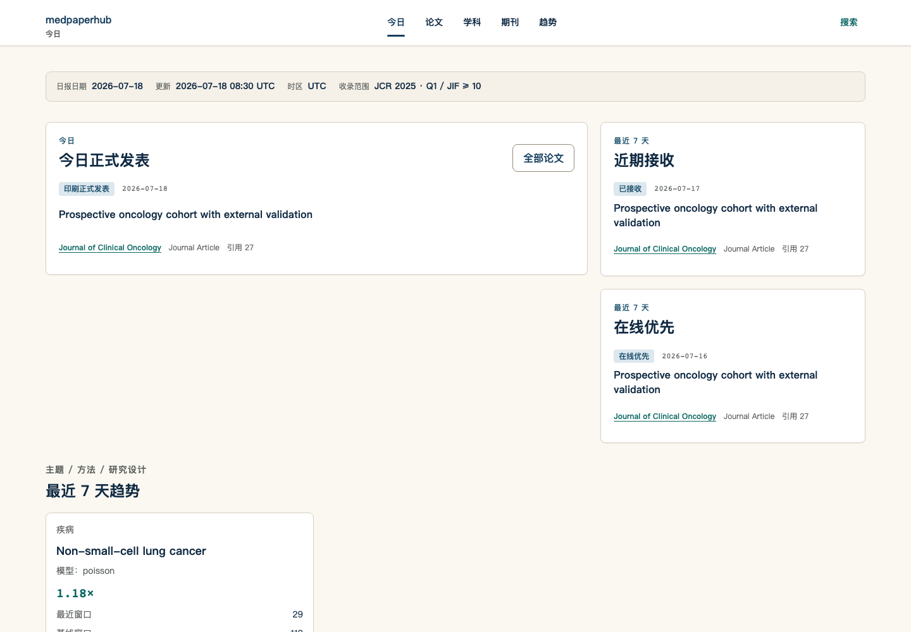
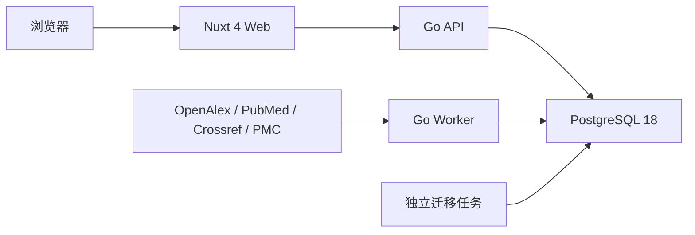

# medpaperhub

medpaperhub 是一个面向医学与生物学科研人员的每日论文情报门户。首页优先回答：今天正式发表了什么、最近接收了什么、哪些文章处于 Online First，以及最近 7 天的主题、方法、期刊和学科趋势。论文检索保留为独立工具，不再主导首页。

后端采用 Go 模块化单体，前端采用 Nuxt 4，PostgreSQL 是唯一规范数据存储。仓库不注入演示论文或 mock 数据；首次启动完成迁移后，界面会如实显示空数据状态，Catalog API 在首次显式发布 generation 前返回 `503 catalog_not_published`。



> 截图使用确定性 E2E Catalog 响应做视觉验收；生产 API、Worker 和 Nuxt 运行时不会加载该测试数据。

## 架构



同一个 Core 镜像包含三个独立二进制：

- `/app/paper-hub-api`
- `/app/paper-hub-worker`
- `/app/paper-hub-migrate`

迁移是一次性任务。Worker 是通过 `docker compose run` 或调度系统显式触发的同步、导入或 Catalog 发布任务，不作为无参数常驻进程启动。API 和 Worker 都不会在启动时隐式执行迁移，也不会隐式发布 Catalog。

## 一键本地启动

前置条件：

- Docker Engine 或 Docker Desktop
- Docker Compose 2.24.4 及以上

启动完整空数据库栈：

```bash
make compose-up
```

服务地址：

- Web：`http://localhost:3000`
- API discovery：`http://localhost:8080/`
- API 健康检查：`http://localhost:8080/health`
- Web 健康检查：`http://localhost:3000/health`
- PostgreSQL：`localhost:5432`

API 与 Web 保持独立部署：`GET http://localhost:8080/` 只返回稳定的 API discovery JSON，不重定向也不托管 Nuxt 页面。API health 的公开 service identity 是 `medpaperhub-api`，Web health 的公开 service identity 是 `medpaperhub-web`；内部 Go module、二进制、镜像、Compose project 和数据库名称保持不变。

## 每日发表情报

`GET /api/v1/home` 返回一个 generation-bound 的 `home-snapshot/v2`。Nuxt 首页只消费这一份不可变快照，并按固定顺序展示：

1. 今日正式发表；
2. 最近 7 天接收；
3. 最近 7 天 Online First；
4. 最近 7 天主题、方法与研究设计趋势；
5. 期刊动态；
6. 学科动态。

发表状态只来自当前 PubMed 投影中可追溯的显式 publication history：

- `ppublish` → `print_published`；
- 满足正式发表语义的 `epublish` → `electronic_published`；
- `accepted` → `accepted`；
- `aheadofprint` → `ahead_of_print`。

系统不会从论文标题、`works.published_at`、抓取时间或跨来源日期拼接推断发表状态。日精度缺失、同一事件日期冲突、provenance 不匹配、JCR 未准入、非 biomedical、撤稿、撤回或 scope excluded 的 Work 不进入首页发表集合。

日报日期由 Catalog 发布参数 `--generated-at` 的 UTC 自然日确定，不在快照生成过程中调用当前系统时间。最近 7 天窗口是包含日报当天的 `[D-6, D]`。每个发表事件都绑定同一个 Work revision 的：

- source record；
- normalized assertion；
- projection assertion；
- PubMed XML source path；
- raw publication status。

集合中的 `pagination.total`、`limit` 与实际不可变 item 数量严格一致，`has_more=false`、`next_cursor=null`。当前 Home 是完整快照，不会通过前端兜底补数量或生成示例文章。

`make compose-up` 会在启动后自动执行严格的部署边界验证。也可以对已经运行的服务单独执行：

```bash
make verify-local
```

如果源码已经新增路由但浏览器仍返回 404，仅刷新页面不会重建旧容器；重新执行 `make compose-up`。完整的端口、路由矩阵、历史 404 根因和陈旧镜像诊断见 [`docs/deployment/service-boundaries.md`](docs/deployment/service-boundaries.md)。

停止服务：

```bash
make compose-down
```

默认值来自 `.env.example`。如需修改端口、数据库凭据或数据源凭据，先创建本地 `.env`：

```bash
cp .env.example .env
```

`.env` 会覆盖示例值，但不会提交到 Git。`POSTGRES_PASSWORD` 与 `DOCKER_DATABASE_URL` 必须保持一致；若密码包含 URL 保留字符，必须在 `DOCKER_DATABASE_URL` 中进行百分号编码。示例数据库凭据和 `CATALOG_CURSOR_SECRET` 都只用于本地开发，不能用于生产环境。

本地 Web 与 API 分别监听 `3000` 和 `8080`，因此浏览器请求属于跨源访问。API 只向 `API_CORS_ALLOWED_ORIGINS` 中逐项列出的精确 origin 返回 CORS 头；默认值只允许 `http://localhost:3000`，不接受 `*`、路径、查询参数或带凭据 URL。修改 Web 域名或端口时，必须同步更新该 allowlist。

## Biomedical Catalog 严格流水线

从空库到公开 Catalog 的唯一顺序是：

1. `paper-hub-migrate up`；
2. `import subjects` 导入版本化 biomedical Subject CSV；
3. `sync pubmed` 在一个命令内完成抓取、raw 持久化、规范化、范围判定与投影；
4. `import jcr` 导入用户明确授权的 JCR CSV；
5. JCR Category 与 Subject rule 的 exact-link reconciliation；该步骤由 Subject/JCR importer 在事务内自动执行，当前没有独立 `reconcile` 命令；
6. `assess venues`；
7. `assess biomedical-eligibility`；
8. `analyze citations` 从一个明确来源生成不可变引用分析 run；
9. `publish catalog` 显式绑定该引用来源和 analysis run；
10. 启动并验证独立的 Go API 与 Nuxt Web。

完整 Docker volume mount、本地原生命令、全部 Worker flags、receipt 查询和验证 SQL 见 [`docs/deployment/biomedical-pipeline.md`](docs/deployment/biomedical-pipeline.md)。

公开 Catalog 的唯一 Venue 准入门槛是：

```text
任一授权 JCR Category 为 Q1 OR exact JIF >= 10
```

对应固定策略版本 `journal-jif-or-q1/v1`。Biomedical Subject exact-link 是公开范围约束，不是第二套期刊质量阈值；系统不会以引用数、OpenAlex `2yr_mean_citedness`、标题相似度或其他推断指标替代 JCR。

`data/venues/jcr-q1.example.csv` 是纯合成测试 fixture，**禁止用于生产导入或 Catalog 发布**。如果没有用户授权的 JCR CSV，不能执行后续 assessment 或 publish；空库 API 的真实路由 `/api/v1/home`、`/api/v1/subjects`、`/api/v1/journals` 必须继续返回 `503 catalog_not_published`，Nuxt `/`、`/subjects`、`/journals` 只呈现等待状态，不生成假数据。

完成发布后启动服务并验证：

```bash
docker compose up -d api web

curl -i http://localhost:8080/api/v1/home
curl -i http://localhost:8080/api/v1/subjects
curl -i http://localhost:8080/api/v1/journals
```

成功响应包含 `X-Request-ID` 和 `X-Catalog-Generation`。不可见、缺失或格式错误的 paper ID 统一返回 404；已知路由的非 GET 请求返回 405 和 `Allow: GET`；未知 `/api` 路由返回独立的 `route_not_found` 404。

## 容器烟测

```bash
make smoke
```

烟测使用独立 Compose 项目和临时数据库层，依次验证：

1. PostgreSQL 健康；
2. 数据库迁移成功退出；
3. API 返回预期健康载荷；
4. Web 返回预期健康载荷；
5. 空库 Catalog 返回规范的 `503 catalog_not_published`；
6. 浏览器 origin 能收到精确的 `Access-Control-Allow-Origin`；
7. Web 首屏通过内部 API 渲染“等待首次同步”。

任何服务失败都会输出该隔离项目的 `ps` 与日志，并在清理容器和卷后返回非零状态。Core 镜像构建会编译 Worker 二进制；由于 Worker 是一次性命令，烟测不会为它伪造常驻进程或 HTTP 健康端点。

## 本地原生开发

前置条件：

- Go 1.26.5
- Node.js 22.22.3
- pnpm 10.29.2
- Docker（Go PostgreSQL 集成测试通过 Testcontainers 启动真实 PostgreSQL）

常用命令：

```bash
make install
make generate
make test
make test-race
make build
make lint-web
make typecheck
```

## 数据源与边界

部署层不会在 API 或 Web 启动时自动抓取外部数据。每类同步都必须由显式、可审计的 Go 命令或调度任务触发，并复用 `.env.example` 中的严格配置。

当前已经落地的命令：

- **OpenAlex**：`sync openalex`，需要 `OPENALEX_CONTACT_EMAIL` 与 `OPENALEX_API_KEY`，用于论文发现与开放元数据同步。
- **PubMed**：`sync pubmed`，需要显式日期窗口、query 或 exact ISSN、`NCBI_TOOL` 与 `NCBI_EMAIL`；可选 `NCBI_API_KEY` 只用于授权配额。该命令已经串联抓取、raw、规范化与投影，不存在单独的 normalize/project CLI。
- **Crossref**：`sync crossref`，需要 `CROSSREF_CONTACT_EMAIL`，用于 DOI、ISSN、许可和出版关系增强。
- **Biomedical Subject**：`import subjects`，导入不可变、版本化、exact JCR Category allowlist，并在事务内执行 exact-link reconciliation。
- **JCR**：`import jcr`，`JCR_IMPORT_PATH` 必须指向用户明确授权的 CSV，`JCR_SOURCE_LICENSE` 必须记录该导出的授权或许可依据。系统不会推断许可，也不会用推断指标替代 JCR 数据。
- **Venue assessment**：`assess venues`，仅接受 `journal-jif-or-q1/v1`，并绑定明确的 JCR receipt 与 metric year。
- **Biomedical eligibility**：`assess biomedical-eligibility`，对当前 Work 批量固化 exact Subject 资格决定。
- **Citation analysis**：`analyze citations`，从一个明确 citation source 生成不可变 citation count、velocity 与 cohort percentile 结果；不会混合来源或把证据不足填成 `0`。
- **Catalog**：`publish catalog`，要求显式传入 formula、时间、JCR 年份、Venue policy、eligibility policy、Subject version、JCR receipt、citation source 与 citation analysis run ID，生成并发布 immutable generation。

尚未注册为 Worker 命令的规划能力：

- PubMed Baseline/Daily Update 文件导入；
- 独立 PubMed normalize/project 命令；
- 独立 JCR/Subject reconciliation 命令；
- PMC OA 全文同步；
- Springer Nature 与 Elsevier 出版商增强。

这些规划项即使存在预留配置，也不能视为已实现；文档、调度或部署不得调用不存在的命令。

当前 Core 容器只发布 API、Worker 与迁移二进制。新增数据源命令时，应作为独立的一次性容器作业或调度任务运行，而不是耦合到 API 启动过程。

### Docker 中导入授权 JCR CSV

CSV 不会被复制进镜像，也不会由 Compose 自动发现。执行导入时应将单个授权文件只读挂载到一次性 Worker 容器，并显式传入容器内路径与授权说明：

```bash
JCR_HOST_PATH=/absolute/path/to/authorized-jcr-export.csv
JCR_SOURCE_LICENSE=organization-authorized-jcr-export

docker compose run --rm \
  --volume "${JCR_HOST_PATH}:/imports/jcr.csv:ro" \
  --env JCR_IMPORT_PATH=/imports/jcr.csv \
  --env JCR_SOURCE_LICENSE="${JCR_SOURCE_LICENSE}" \
  worker /app/paper-hub-worker import jcr --file /imports/jcr.csv
```

`JCR_HOST_PATH` 必须是宿主机上的绝对路径；容器内固定使用 `/imports/jcr.csv`。`JCR_SOURCE_LICENSE` 应保存可审计的授权或许可标识，不能留空，也不能由文件名、期刊指标或来源域名推断。Worker 会严格校验 `--file` 与 `JCR_IMPORT_PATH` 完全一致；路径不一致、许可为空或 CSV 未显式挂载时，导入会失败。

不要把 `data/venues/jcr-q1.example.csv` 代入上述命令。生产文件必须来自用户授权导出，并且每一行都能通过 ISSN-L、print ISSN 或 eISSN 精确解析到一个已经由论文投影建立的 Venue。

## 生产部署边界

- Web 与 API 分别部署和扩缩容；Worker 同步/导入任务由独立 Job 或调度器按需执行。
- API 与 Worker 复用同一个 Core 镜像，但使用不同命令和生命周期。
- PostgreSQL 使用托管实例，并通过生产级 Secret 管理 `DATABASE_URL`。
- API 必须通过生产 Secret 管理器注入独立的 `CATALOG_CURSOR_SECRET`。该 secret 必须至少 32 bytes、不能带首尾空白、不能写入日志，并且所有 API 副本必须使用同一稳定值；轮换会使轮换前签发的分页 cursor 失效。
- API 必须显式配置 `API_CORS_ALLOWED_ORIGINS`。每个值都是浏览器可见 Web 的精确 `http://` 或 `https://` origin；生产环境不得使用通配符，也不得把内部容器地址加入浏览器 allowlist。
- Catalog 发布 Job 使用只要求数据库配置的 `catalog-publish` role，并始终显式传入经过版本管理的 `--formula-version`、确定性的 `--generated-at`、JCR/Subject/policy 版本和 JCR receipt；生产发布流程不得隐式使用当前时间。
- 迁移在发布前作为独立作业运行；采用 expand/contract 迁移，旧版本应用必须能与扩展后的数据库并存。
- Web 对浏览器暴露的 `NUXT_PUBLIC_API_BASE_URL` 必须是外部可解析的 HTTPS 地址；容器内部访问使用私有服务地址。
- Subject 与 JCR CSV 只允许以只读 volume 挂载到对应的一次性 Worker Job；不得复制进运行镜像或由 API/Web 自动扫描。
- 没有授权 JCR 时不得挂载 synthetic example、不得发布空或伪造 generation；保持 Catalog 未发布状态并向公开 Catalog API 返回 503。
- 本地 Compose 文件不是生产 Secret 或高可用编排方案。

## CI 与发布

- `.github/workflows/ci.yml`：Go 格式、Vet、单元/集成/竞态测试，OpenAPI 契约测试，Nuxt 生成、Lint、类型检查、测试、构建和 Playwright。
- `.github/workflows/container.yml`：解析 Compose、构建 Core/Web 镜像并执行空数据库烟测，不推送镜像。
- `.github/workflows/publish.yml`：仅在语义化版本标签或已发布 GitHub Release 上运行；重新执行源码和容器验证后，将多架构 Core/Web 镜像发布到 GHCR，并附带 provenance 与 SBOM。

## 仓库布局

```text
apps/web/                 Nuxt 4 Web
services/core/            Go API、Worker、迁移与领域代码
contracts/openapi.yaml    OpenAPI 3.1 契约
data/venues/              授权 JCR 导入说明与合成示例
data/subjects/            版本化 biomedical Subject registry
docs/deployment/          部署边界与数据流水线
docker-compose.yml        本地完整栈
docker-compose.test.yml   隔离烟测覆盖
```

## 路线图

- 完成可审计的数据源命令与队列消费闭环；
- 让公开页面完全通过版本化 OpenAPI 获取真实数据；
- 增加生产可观测性、备份恢复演练和滚动发布验证；
- 在真实来源同步后验证论文、趋势、研究地图与机会分析端到端流程。

## License

Apache License 2.0，见 `LICENSE`。
