# medpaperhub 每日发表情报设计

**日期：** 2026-07-17  
**状态：** 用户已批准  
**范围：** 医学与生物学，且仅公开 `JCR Q1 OR exact JIF >= 10` 的期刊论文

## 1. 目标

首页不再以检索为中心，而是回答科研人员每天最关心的六个问题：

1. 今天正式发表了什么？
2. 最近有哪些文章被接收？
3. 最近有哪些文章进入 Online First / Ahead of Print？
4. 最近 7 天哪些主题、方法和研究设计在增长？
5. 哪些重点期刊最近发了什么？
6. 各医学生物学学科最近发了什么？

搜索保留为右上角辅助入口，跳转到 `/papers#papers-q`。首页不展示宣传语、大搜索框、技术 generation 卡片、完整覆盖率阵列、空白保存视图或长篇说明文字。

## 2. 产品边界

### 2.1 可以公开

- 已通过版本化准入规则的医学、生物学期刊论文；
- 有明确 PubMed 状态字段和日精度日期的正式发表、接收和在线优先事件；
- 有明确来源、观察时间、公式版本和样本量的引用与趋势指标；
- 经过授权 JCR CSV 导入并可追溯到导入回执的 Q1/JIF 证据。

### 2.2 不可以公开为确定事实

- 根据标题中的 `accepted`、`online first`、`ahead of print` 猜状态；
- 把抓取时间、PubMed 入库时间或 `works.status=active` 当作发表时间；
- 把 `ArticleDate DateType="Electronic"` 单独推断为 Online First；
- 把 PubMed 的状态与 Crossref 的日期拼成一个事件；
- 把全文可用、收藏、Altmetric 或引用量冒充下载量；
- 在没有授权 JCR 数据时用第三方榜单、SJR、CiteScore 或 fixture 填充公开目录；
- 日期冲突时取最早、最晚、平均值或多数值。

## 3. 端到端数据流

```mermaid
flowchart LR
    A["PubMed E-utilities / Baseline / Daily Update"] --> B["原始 XML source_records"]
    B --> C["normalized-record/v3"]
    C --> D["不可变 publication event assertions"]
    D --> E["当前 publication state projection"]
    E --> F["JCR Q1 / JIF≥10 + biomedical gate"]
    F --> G["不可变 Catalog generation"]
    G --> H["GET /api/v1/home"]
    H --> I["Nuxt 每日论文情报首页"]
```



每个公开事件必须能沿着以下链路回溯：

```text
Home item
  -> Catalog generation
  -> Work publication state
  -> Publication event assertion
  -> Projection assertion
  -> Normalized assertion
  -> Source record
  -> PubMed 原始 XML path
```

## 4. PubMed 状态解析

新增解析：

- `Article/@PubModel`
- `PubmedData/PublicationStatus`
- `PubmedData/History/PubMedPubDate/@PubStatus`
- History 中的 `Year/Month/Day`

标准事件：

```text
print_published
electronic_published
ahead_of_print
accepted
```

严格规则：

| 公开事件 | 必须满足 |
| --- | --- |
| 正式印刷发表 | 同一 PubMed source record 的 History 中存在 `PubStatus=ppublish`，日期精度为 day |
| 正式电子发表 | 同一 source record 中存在 `PubStatus=epublish`，且该记录的明确状态不是 `aheadofprint`，日期精度为 day |
| 接收 | History 中存在 `PubStatus=accepted`，日期精度为 day |
| 在线优先 | 存在明确 `PubStatus=aheadofprint`，日期精度为 day |

标题永不参与判定。状态与日期必须来自同一 source record 和同一 normalized/projection assertion。

## 5. 数据模型

新增 migration：

```text
services/core/migrations/000018_publication_event_assertions.sql
```

### 5.1 不可变证据表

```text
work_publication_event_assertions
- id
- projection_assertion_id
- normalized_assertion_id
- source_record_id
- work_id
- event_kind
- event_date
- date_precision
- source_date
- status_raw
- publication_model_raw
- source_path
- ordinal
- created_at
```

约束：

- 只接受受控 `event_kind` 和 `date_precision`；
- `source_date` 保存原始结构化日期，不因公开日报只用日精度而丢弃月/年精度证据；
- assertion 通过复合外键绑定同一个 projection、normalized assertion、source record 和 Work；
- 同一 projection 内的 XML ordinal 唯一；
- 表只允许 insert，禁止 update/delete。

### 5.2 当前状态投影

```text
work_publication_states
- work_id
- projection_assertion_id
- normalized_assertion_id
- source_record_id
- print_published_on
- print_published_state
- electronic_published_on
- electronic_published_state
- ahead_of_print_on
- ahead_of_print_state
- accepted_on
- accepted_state
- publication_model_raw
- publication_status_raw
- updated_at
```

状态值：

```text
known
missing
conflict
```

规则：

- 同一事件只有一个日精度日期：`known`；
- 没有符合要求的事件：`missing`；
- 同一 source assertion 对同一事件给出多个不同日精度日期：`conflict`；
- `conflict` 不进入日报列表，但保留可审计状态；
- 该表是可替换的当前投影，不加 append-only trigger；
- 只有当前 winning projection 可以更新对应 Work 的状态。

### 5.3 规范载荷升级

`normalized-record/v2` 保持不可变；新增：

```text
normalized-record/v3
```

新增字段：

```json
{
  "publication_model": "Print-Electronic",
  "publication_status": "ppublish",
  "publication_history": [
    {
      "status": "accepted",
      "date": {
        "year": 2026,
        "month": 7,
        "day": 15,
        "precision": "day"
      },
      "source_path": "/PubmedArticle/PubmedData/History/PubMedPubDate[1]"
    }
  ]
}
```

历史 v1/v2 normalized assertions 不做 SQL 猜测回填。需要升级时，从 `source_records.raw_payload` 重放原始 XML，生成新的 v3 assertion。

## 6. API 设计

继续使用：

```http
GET /api/v1/home
```

原因：

- 首页所有模块必须来自同一个不可变 Catalog generation；
- 避免浏览器并发请求时混入不同生成批次；
- 前端不负责拼接、去重或重新判定论文状态。

新增顶层字段：

```json
{
  "publication_updates": {
    "calendar_date": "2026-07-17",
    "calendar_timezone": "UTC",
    "formal_publications_today": {
      "analysis": {},
      "items": []
    },
    "recent_acceptances": {
      "analysis": {},
      "items": []
    },
    "recent_online_first": {
      "analysis": {},
      "items": []
    }
  }
}
```

事件条目：

```json
{
  "paper": {
    "id": "uuid",
    "title": "Paper title",
    "journal": {
      "slug": "journal-...",
      "title": "Journal title"
    }
  },
  "event": {
    "kind": "accepted",
    "date": "2026-07-15",
    "date_precision": "day",
    "publication_status": "accepted",
    "publication_model": "Print-Electronic",
    "provenance": {
      "source": "pubmed",
      "source_record_id": "uuid",
      "normalized_assertion_id": "uuid",
      "projection_assertion_id": "uuid",
      "source_path": "/PubmedArticle/PubmedData/History/PubMedPubDate[1]"
    }
  }
}
```

窗口：

- `formal_publications_today`：Catalog generation 固定日历日期；
- `recent_acceptances`：最近 7 个完整日历日；
- `recent_online_first`：最近 7 个完整日历日；
- 只收日精度日期；
- 按事件日期降序，再按规范论文 key 排序；
- 不用滚动 24 小时。

同时修复现有 OpenAPI 偏差：运行时 `PaperAnalysisCollection` 含 `pagination`，合约也必须明确包含该字段。

## 7. 首页 UI

### 7.1 导航

```text
今日 → 论文 → 学科 → 期刊 → 趋势
```

- “研究机会”退出一级导航，保留 `/opportunities` 页面；
- 右上角只保留“搜索”，跳到 `/papers#papers-q`；
- 删除“数据状态”按钮；
- 删除全局 `DiscoveryRail`。

### 7.2 桌面布局

```text
┌────────────────────────────────────────────────────┐
│ medpaperhub  今日  论文  学科  期刊  趋势      搜索 │
├────────────────────────────────────────────────────┤
│ 2026-07-17  已更新  JCR 2025  Q1 / JIF≥10          │
├───────────────────────────────┬────────────────────┤
│ 今日正式发表（8 列）           │ 近期接收（4 列）    │
│                               ├────────────────────┤
│                               │ 在线优先（4 列）    │
├───────────────────────────────┴────────────────────┤
│ 最近 7 天趋势                                        │
├──────────────────────────┬─────────────────────────┤
│ 期刊动态                  │ 学科动态                 │
└──────────────────────────┴─────────────────────────┘
```

移动端顺序：

1. 日期和状态；
2. 今日正式发表；
3. 近期接收；
4. 在线优先；
5. 7 日趋势；
6. 期刊动态；
7. 学科动态。

### 7.3 视觉规则

- 暖白背景、深海军蓝文字、克制青绿色强调；
- 不使用论文配图、渐变、玻璃拟态和装饰插画；
- 以标题、期刊、事件日期、Publication Type 和引用状态为核心；
- 不重复展示每个模块的完整分析元数据；
- 无数据时显示短状态，不使用假论文或假统计；
- 默认高信息密度，但保证 44px 触控目标、键盘导航和可见焦点。

## 8. 正确性与验收

### 8.1 单元与集成测试

- PubMed XML 能精确解析 `PubModel`、`PublicationStatus` 和 History；
- 月/年精度事件保留证据但不进入日报；
- 相同事件的冲突日期产生 `conflict`；
- `ArticleDate Electronic` 不能单独产生在线优先；
- v2 assertion 保持不变，v3 可从 raw payload 重放；
- publication event assertion 的 provenance 复合外键不可跨 Work/source 拼接；
- Catalog 只发布 JCR/biomedical gate 内的 Work；
- `/api/v1/home` 与 OpenAPI schema 一致；
- 首页不再渲染大搜索框、宣传语和 DiscoveryRail。

### 8.2 浏览器验收

- 1440px：8+4 主布局成立；
- 768px：无横向溢出，模块层级清楚；
- 390px：单列顺序正确；
- 搜索入口跳转 `/papers#papers-q`；
- 空目录、API 错误和缺失数据不生成示例内容；
- 键盘可访问全部导航和卡片链接。

