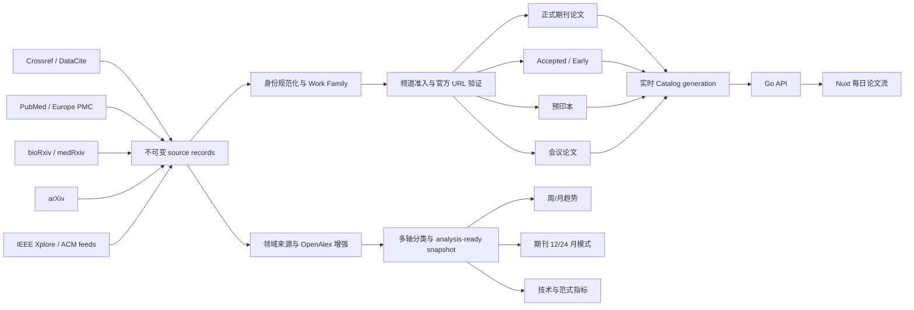

# medpaperhub 产品真相与多来源论文情报架构设计

**日期：** 2026-07-18  
**状态：** 用户已批准  
**产品名称：** `medpaperhub`  
**技术边界：** Go API/Worker/Migrate、Nuxt Web、PostgreSQL，前后端独立部署

## 1. 产品定位

`medpaperhub` 不是以检索为核心的文献数据库，也不是替代 PubMed、Google Scholar
或 ResearchRabbit 的通用学术搜索工具。它是面向医学、生物学和计算机科学科研人员的
公开论文情报门户，持续回答四个问题：

1. 今天和最近新发表了什么？
2. 某本期刊最近 12/24 个月在发表什么内容和研究模式？
3. 最近一周、一个月有哪些主题、技术和研究设计正在增长？
4. 哪些技术或研究范式表现出新颖性、增长、扩散或成熟度变化？

首页以每日论文流、期刊动态、趋势和技术为核心。搜索保留为辅助入口，不重新成为
首屏主任务。

## 2. 服务对象

第一核心用户：

- 医学、生物学和计算机科学 PI、教授和青年 PI；
- 临床科研人员和科研型医生；
- 负责课题方向、组会和文献情报的博士后及高年级博士。

这些用户不是为了完成一次检索而访问产品，而是为了建立持续、低成本、可复核的
领域观察习惯。

## 3. 产品范围

### 3.1 学科范围

公开目录只覆盖：

```text
Medicine
Biology
Computer Science
```

综合期刊中的文章必须通过文章级学科分类后才能进入对应领域的分析结果。分类不覆盖
或证据不足的文章可以保留在内部来源记录中，但不能被计入领域趋势。

### 3.2 内容频道

公开论文不能只按期刊论文建模，冻结为四个相互区分的内容频道：

```text
journal_published       正式期刊论文
accepted_early          Accepted / Pending / Online First / Ahead of Print
preprint                预印本及其修订版本
conference_proceeding   正式会议论文
```

JCR 只约束期刊频道。预印本和会议论文没有 JCR Quartile，必须使用各自的版本化
准入注册表。所有频道共同遵守稳定身份、官方 URL、生命周期和来源可追溯门槛。

频道和生命周期不是从 `venue_type`、Crossref type 或内容分析中的 `PaperType`
推导。权威状态由以下不可变断言和版本化投影组成：

```text
work_channel_assertions
work_channel_decisions
work_lifecycle_assertions
work_lifecycle_states
work_channel_admission_decisions
```

每个决定必须保存 source record、source path、policy version、理由和生效时间。

首页按频道回答：

1. 今日正式发表；
2. 今日新预印本；
3. 最新会议论文；
4. 最近接收或 Online First；
5. 今日新发现。

### 3.3 正式期刊和 Early Access 准入

期刊注册表来自用户明确授权、带 edition year、metric year、JCR Category、JIF
Rank、Category Journal Count、JIF Percentile 和导入回执的 JCR 数据。

在允许的 JCR Category 内，准入规则冻结为：

```text
Quartile = Q1
```

`JIF Percentile >= 50` 不作为额外条件，因为 Q1 已经是 Category 内的第一四分位。
Rank、Category Journal Count 和 JIF Percentile 继续作为公开证据保存，但不再作为
第二道质量门槛。一个期刊属于多个 Category 时，只要在任意一个允许 Category 中为
Q1 即可准入。

`accepted_early` 必须属于同一套 Q1 期刊注册表，并且具有同一来源中的明确
accepted、pending、ahead-of-print 或 online-first 状态和经过验证的官方 URL。

### 3.4 预印本准入

预印本不使用 JCR。公开门槛冻结为：

```text
trusted preprint server
AND stable preprint identifier
AND official URL verified
AND posted date and version known
AND domain assignment resolved
AND not withdrawn
```

第一批可信预印本来源：

```text
bioRxiv
medRxiv
arXiv
Europe PMC Preprints
NIH Preprint Pilot
Research Square records available through authorized structured sources
```

预印本必须明确标记为未形成正式 Version of Record，不能与正式期刊论文混用 JCR
徽标或同行评审状态。

### 3.5 会议论文准入

会议论文不使用 JCR。第一版冻结为：

```text
official IEEE or ACM proceeding
OR
versioned reviewed conference allowlist
```

会议 Registry 必须区分 registry version、会议系列、具体 event、准入 entry、稳定
identifier 和官方 host，保存主办组织、年份、来源、版本和审阅记录。不能根据标题
中的 conference、proceedings 或会议缩写猜测准入。

### 3.6 非目标

第一阶段不做：

- 全学科、全期刊覆盖；
- 每本期刊独立 DOM 爬虫；
- 依赖未知来源的 JCR 榜单发布生产目录；
- 跨出版社统一下载量或阅读量；
- 根据标题猜 accepted、ahead-of-print、研究类型或官方 URL；
- 由大模型自由生成没有结构化证据的“研究机会”；
- 将 OpenAlex citedness、SJR 或 CiteScore 冒充 JIF。
- 把预印本标成同行评审论文；
- 对预印本、会议论文使用 JCR 门槛；
- 在没有许可依据时抓取或公开受限的出版社全文；

## 4. 来源分层与职责

### 4.1 官方首发来源

第一方平台用于尽早发现和提供官方 URL：

```text
bioRxiv / medRxiv API
arXiv API / OAI-PMH
IEEE Xplore API
ACM Digital Library 官方页面或 RSS/TOC
出版社 API / RSS
```

第一阶段不为每本期刊开发 DOM 爬虫。只有提供稳定、可授权的 API、OAI-PMH、
RSS/TOC 或结构化 feed 时才新增官方 connector。

### 4.2 DOI 注册机构

#### Crossref

Crossref 是期刊论文和 accepted/online-first 热链路的主要通用发现源，负责：

- DOI 和期刊文章身份；
- ISSN、Publisher 和容器信息；
- created、deposited、online、print、accepted 等来源断言；
- license、relation 和版本关系；
- DOI resolver URL。

Worker 必须维护两个独立、可恢复的水位：

```text
crossref_created_watermark
crossref_updated_watermark
```

新记录使用 `from-created-date`，已有记录变化使用 `from-update-date`。不能把
`indexed` 时间当作新论文时间，因为 Crossref 重新索引旧记录时会改变该字段。

Crossref 中的 `posted-content` 和显式 `is-preprint-of` / `has-preprint` relation
也作为预印本版本关系证据，但不能替代预印本服务器的官方状态。

#### DataCite

DataCite 用于补充 Crossref 未覆盖的 DOI 资源、仓储记录和预印本。DataCite 断言作为
独立 source record 保存，不能覆盖 Crossref 或预印本服务器事实。

### 4.3 医学和生命科学来源

#### PubMed

PubMed 是医学、生物学语义和 publication history 的主来源，负责：

- PMID、PMCID、DOI；
- 标题、结构化摘要、作者和机构；
- MeSH、Publication Type；
- received、revised、accepted、aheadofprint、epublish、ppublish；
- 撤稿、勘误和关联出版物。

PubMed 通过 E-utilities 每小时增量同步，同时保留 Daily Update 文件作为同源的
完整追赶和重放通道。PubMed 缺失不能阻塞 Crossref 热链路公开，但会影响内容分类和
分析就绪状态。

#### Europe PMC

Europe PMC 负责生命科学论文和预印本增强，包括 PMID/PMCID/DOI 对齐、预印本记录、
开放全文位置、引用关系和版本关联。Europe PMC 不是对 PubMed 字段的无来源覆盖。

#### bioRxiv / medRxiv

bioRxiv 和 medRxiv API 是对应预印本的第一发现来源，负责预印本标识、posted date、
version、category、官方 URL 和来源级 usage snapshot。来源级 PDF 下载量可以保存，
但不得与期刊下载量合并或跨平台比较。

### 4.4 计算机科学和工程来源

#### arXiv

arXiv 是计算机科学预印本的第一发现来源。普通 API 用于小批查询，OAI-PMH 用于持续
增量同步。系统保存 arXiv ID、版本、submitted/updated 时间和官方 abstract URL。

#### IEEE Xplore

IEEE Xplore 是 IEEE 期刊、会议论文、书籍和标准的官方元数据来源。IEEE 期刊仍须
满足 JCR Q1；IEEE 会议论文使用会议注册表。生产接入必须保存 API 授权依据和速率
限制配置。

#### ACM Digital Library

ACM 期刊使用 JCR Q1；ACM 会议论文使用会议注册表。发现优先使用 Crossref DOI 和
ACM 官方 RSS/TOC/页面，不能假设存在无限制公共 API。

### 4.5 OpenAlex：引用和研究网络增强

OpenAlex 不承担第一发现，按 DOI 或 OpenAlex ID 补全：

- source-specific cited-by count 和 counts by year；
- 作者、机构、国家和团队；
- 开放获取位置；
- 引用图和跨领域扩散。

引用必须保存为带 `observed_at` 的来源快照，不能覆盖为无来源的最终计数。

## 5. 热链路与分析链路



### 5.1 热链路

目标是回答“刚刚和今天新出现了什么”。

运行节奏：

```text
Crossref created/update       每 2 分钟
bioRxiv / medRxiv             每 5 分钟
arXiv OAI-PMH                 每小时
IEEE Xplore                   每 10 分钟
DataCite                      每 10 分钟
URL verification              候选记录进入后立即执行
实时 Catalog micro-batch      每 5 分钟
```

目标服务等级：

```text
对应首发 API 可见后，按该来源调度周期进入 medpaperhub
```

Crossref 来源的目标仍是 API 可见后 5 分钟内公开。其他来源按各自授权速率和调度周期
计算。该目标不等于“出版社官网上线后 5 分钟”，因为没有稳定 feed 的出版社仍无法
观测精确首发时间。

### 5.2 分析链路

目标是回答期刊模式、周/月趋势和技术变化，不追求分钟级更新。

运行节奏：

```text
PubMed E-utilities            每小时
PubMed Daily Update           每日同源追赶
Europe PMC                    每 6 小时
OpenAlex 元数据增强           每 6 小时
OpenAlex 引用快照             每日
多轴分类                      每次来源投影变化后
分析快照                      每日
```

分析采用明确 cutoff，例如：

```text
analysis_cutoff = generated_at - 48 hours
```

只有在 cutoff 前已经满足分析证据要求的论文才能进入趋势和期刊模式。实时论文可以
先公开，但不能在补全前污染分析结果。

## 6. 时间语义

必须区分：

```text
source_created_at       来源第一次创建记录
source_deposited_at     来源最近一次收到提交
source_indexed_at       来源内部索引时间
official_online_date    来源明确声明的在线发表日期
official_print_date     来源明确声明的印刷日期
preprint_posted_date    预印本服务器明确声明的首次 posted 日期
conference_date         官方 proceeding 声明的会议或发表日期
first_observed_at       medpaperhub 第一次看到记录
url_verified_at         官方链接通过验证
catalog_published_at    首次进入公开 Catalog
```

首页的两个集合不能混淆：

- **今日正式发表：** 同一来源断言中 `official_online_date` 或适用的正式发表事件为今天；
- **今日新预印本：** 可信预印本来源的 `preprint_posted_date` 为今天；
- **最新会议论文：** 官方 proceeding 来源明确提供会议论文发表或上线事件；
- **今日新发现：** `first_observed_at` 为今天，正式发表日期可能更早。

系统不能把抓取时间、Crossref indexed 时间或 PubMed Entrez 时间冒充正式发表时间。

## 7. 官方 URL 公开硬门槛

公开状态机：

```text
discovered
-> venue_eligible
-> identity_resolved
-> url_verified
-> publicly_visible
```

每篇公开论文必须至少有一个经过验证的可跳转 URL。优先保存：

```text
official_article_url
doi_url
official_preprint_url
official_proceeding_url
```

URL 数据必须拆成三层：

```text
work_url_candidates
work_url_verifications
current_work_official_links
```

候选层至少保存来源记录、source path、内容频道、link role 和 parser version。
验证层至少保存：

- 来源 URL；
- 完整 redirect chain；
- 最终 HTTPS URL；
- HTTP 观察结果；
- 页面或结构化元数据中与 Work 一致的 DOI/官方文章标识；
- 验证时间；
- verifier version；
- policy version；
- expires_at；
- 失败原因。

当前官方链接是从验证历史生成的版本化投影，不能覆盖历史验证。期刊和
`accepted_early` 的当前链接必须是出版社页面或 DOI resolver 且标识一致；预印本
必须是可信服务器 landing/abstract URL；会议论文必须是官方 proceedings 或
publisher 页面。PubMed 和 OpenAlex URL 只能作为辅助跳转，不能单独满足公开门槛。

禁止根据标题、期刊名称、卷期页码或 DOI 模式拼接 URL。没有通过验证的记录进入：

```text
url_state = pending
```

并保留在内部队列，不得进入公开 Catalog。

论文卡片交互固定为：

```text
卡片 -> /papers/{id} -> 查看原文 -> current official link
```

## 8. 记录身份、去重与来源冲突

规范身份优先级：

1. 规范化 DOI；
2. PMID、PMCID、arXiv ID、bioRxiv/medRxiv DOI、IEEE/ACM article ID、
   OpenAlex ID 等来源标识；
3. 出版社页面中的稳定官方文章标识和 canonical URL。

标题相似度不作为自动合并依据。缺少可证明共同身份的记录保持独立，进入人工或后续
来源对账队列。

同一研究的不同版本必须形成 `Work Family`，而不是覆盖或重复计数：

```text
Preprint
-> Revised Preprint
-> Accepted Manuscript
-> Online First
-> Version of Record
-> Correction / Retraction
```

Work Family 的权威数据结构至少包括：

```text
work_families
work_family_memberships
work_relation_assertions
work_relation_decisions
```

每个 Work 必须且只能有一个当前 family membership；没有已证明关系的 Work 创建
singleton family。禁止自环和冲突 membership。关系断言必须保存 source path，
关系决定必须保存 policy version 并支持冲突、撤销和 supersede。

自动建立 family 关系必须依赖来源显式 relation 或稳定共享标识。标题和作者相似度
只能生成待审候选，不能自动合并。默认趋势按 `work_family_id` 去重；详情页保留完整
版本时间线。

不同来源的字段保存为独立 assertion。字段获胜策略必须版本化。发表日期、accepted
状态和 ahead-of-print 状态不能从不同来源拼成一个事件；来源冲突时保留冲突并从
需要精确日期的公开集合中排除。

## 9. 论文多轴分类

分类不是单一互斥标签，冻结为五轴：

### 9.1 Content Type

```text
Original Research
Review
Systematic Review / Meta-analysis
Methods / Resource
Protocol
Guideline / Consensus
Perspective
Editorial / Commentary
News
Correction / Retraction
```

### 9.2 Research Mode

```text
Wet Lab
Computational / Dry Lab
Clinical
Translational
Population / Epidemiology
Theoretical
Systems / Engineering
Mixed
```

### 9.3 Research Purpose

```text
Mechanism
Principle / Theory
Discovery
Method Development
Model Development
Validation
Benchmark
Prediction
Diagnosis
Prognosis
Treatment / Intervention
Causal Inference
Descriptive
Replication
```

### 9.4 Study Design

医学和生物学包括 In Vitro、Animal Model、Organoid、Cohort、RCT、Case-control、
Cross-sectional、Multicenter、External Validation、Single-cell、Spatial Omics
和 Clinical Trial 等。

计算机科学包括 Algorithm Development、Benchmark、Ablation Study、Simulation、
User Study、Systems Evaluation、Theoretical Proof、Dataset Construction、
Model Scaling、Agent Evaluation 和 Security Evaluation 等。

### 9.5 Technique

医学和生物学包括 AI、Single-cell、Spatial Transcriptomics、CRISPR、Proteomics、
Metabolomics、Organoid、Protein Design、Gene/Cell Therapy、Digital Pathology
和 Medical Imaging 等。

计算机科学包括 Foundation Model、Multimodal Model、Agent、RAG、Reinforcement
Learning、GNN、Computer Vision、NLP、Robotics、Systems、Database、Security、
Compiler 和 HCI 等。

分类输出必须保存：

```text
taxonomy_version
classifier_version
source_fields
evidence_spans
confidence
classified_at
```

PubMed Publication Type/MeSH 和来源结构化字段是来源事实；模型标签是版本化分析结果，
不能冒充出版社或 PubMed 的原始断言。

## 10. 分析就绪门槛

实时公开与分析就绪是两个不同状态。

`publicly_visible` 至少要求：

```text
content channel eligibility accepted
AND stable identity
AND verified outbound URL
AND not retracted/withdrawn
```

`analysis_ready` 还要求：

```text
canonical channel event before analysis cutoff
AND required classification axes resolved
AND source provenance complete
AND domain and applicable Venue assignments resolved
AND no decisive source conflict
```

未知内容类型可以出现在“最新上线”，但不能进入“研究论文精选”或趋势计算。页面只展示
已经验证的字段，缺失字段不使用推断值补位。

## 11. 四个核心分析产品

### 11.1 每日新论文

按今日正式发表、今日新预印本、最新会议论文、今日新发现、最近 accepted 和最近
online first 分组。每条记录展示频道、Venue/服务器、正式或 posted 日期、首次发现
时间、已知分类标签和官方原文入口。

### 11.2 期刊近期可观察发表模式

按 12/24 月窗口分析：

- 疾病和主题；
- Technique；
- Research Mode；
- Research Purpose；
- Study Design；
- Content Type。

与同 JCR Category、同窗口期刊比较，输出支持论文数、覆盖率、effect size、
置信区间和 FDR。产品只能描述“近期可观察发表模式”，不能声称知道编辑部主观偏好。

### 11.3 周/月趋势

按周和月统计：

- 发文量；
- 独立团队数；
- 独立期刊数；
- 跨领域扩散；
- source-specific 引用增长。

计数数据使用预声明的 Poisson 或 Negative Binomial 模型，保存公式版本、样本量、
置信区间和多重比较校正结果。

### 11.4 技术和范式变化

不生成一个黑箱总分，拆分为：

```text
Novelty
Momentum
Diffusion
Maturity
```

摘要或结构化证据不足时，Novelty 和 Maturity 必须为 `insufficient_evidence`，不能
根据标题生成确定结论。

## 12. 前后端和部署边界

### Go API

- 只读取已发布 Catalog generation；
- 不执行迁移、抓取、分类或 Catalog 发布；
- 对 Web 暴露版本化 `/api/v1/*`。

### Go Worker

- 执行 source sync、normalize、project、URL verify、classify、analyze 和 publish；
- 每个命令使用最小权限和显式参数；
- 来源调用失败时不推进 watermark；
- 支持从不可变 raw source record 重放。

### Nuxt Web

- 不连接 PostgreSQL；
- 不持有 JCR、NCBI、Crossref、DataCite、Europe PMC、bioRxiv/medRxiv、arXiv、
  IEEE、OpenAlex 或数据库凭据；
- 不自行拼接多个 generation 的分析结果；
- 不在浏览器进行去重、来源获胜或 URL 猜测；
- 搜索保持辅助入口。

### PostgreSQL

- 保存来源原文、不可变 assertions、watermarks、URL verification receipts、
  classification runs、analysis snapshots 和 Catalog generations；
- 生产环境执行备份、恢复演练和 retention policy；
- 前端不能直接访问。

## 13. 正确性与运行要求

- 每个来源保存独立 watermark，只有完整成功处理当前窗口后才能原子推进；
- 请求窗口带确定性 overlap，并依靠来源 ID/DOI 和不可变断言实现幂等；
- API 限流或失败时遵守 `Retry-After`，不切换成未知来源数据；
- 所有 source record 保存原始 payload checksum、observed_at 和 connector version；
- Catalog 发布事务必须重新验证期刊准入、URL、生命周期和分析边界；
- 每个公开字段能回溯到 source record 或版本化 analysis run；
- 监控 source lag、ingestion lag、URL verification lag、catalog lag、失败率和
  analysis-ready coverage。

## 14. 当前实现必须替换的旧真相

现有代码和文档中的以下规则失效：

- `JCR Q1 OR JIF >= 10`；
- `JCR Q1 AND JIF Percentile >= 87.5`；
- 只允许 PubMed publication history 驱动公开每日论文；
- OpenAlex 作为主要论文发现来源；
- 只有正式期刊论文一种内容频道；
- 对预印本和会议论文套用 JCR 规则；
- 不保存预印本到正式发表的 Work Family 和版本关系；
- 没有 verified official URL 仍允许进入 Catalog；
- 医学、生物学双领域边界；
- 实时论文和趋势分析使用同一套完成门槛；
- “等待首次同步”作为 Catalog 未发布的统一文案。

新的公开真相是：

```text
三领域全部 JCR Q1 期刊注册表
+ 预印本和会议独立准入注册表
+ Crossref / DataCite / 官方首发源发现
+ URL 公开硬门槛
+ PubMed / Europe PMC / OpenAlex 异步补全
+ Work Family 与版本时间线
+ 实时公开和 analysis-ready 双状态
+ immutable micro-batch Catalog
```

## 15. 验收标准

### 数据发现

- 使用 Crossref created/update 双水位增量；
- 旧记录重新 indexed 不会被当作新论文；
- bioRxiv、medRxiv、arXiv、DataCite 和 IEEE 使用各自独立 watermark；
- 同一 DOI 重放不会产生重复 Work；
- 同一研究的预印本和正式发表版本不会在趋势中重复计数；
- 来源失败不会推进 watermark。

### URL

- 无 verified URL 的 Work 无法进入公开 Catalog；
- 每个公开论文详情页能跳转到保存的官方页面；
- URL 验证结果可按 source record 和 verifier version 审计。

### 产品

- 首页首屏回答今天和最近发表了什么，不以搜索框为中心；
- 首页分别展示正式发表、预印本、会议论文和 accepted/online-first；
- 期刊页提供 12/24 月发表模式；
- 趋势页提供周/月窗口和统计证据；
- 技术页分开显示 Novelty、Momentum、Diffusion、Maturity；
- 公开论文、分析论文和来源覆盖率状态不混淆。

### 工程

- Go、Nuxt、PostgreSQL 继续独立部署；
- 全部新增规则有单元、集成和端到端测试；
- 从空库、授权 JCR/预印本/会议注册表导入、多来源同步、版本对账、URL 验证到
  Catalog 发布可以完整重放；
- 文档、Compose、CI 和生产调度与实际运行命令一致。
